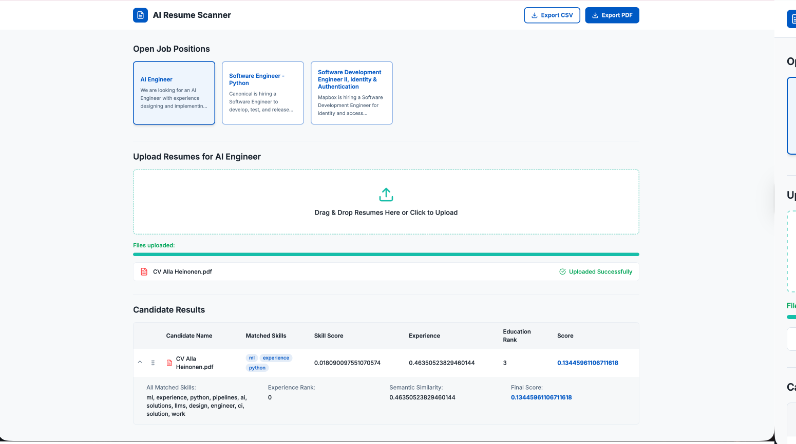

# HireMind AI – NLP Resume Screening Demo

## Project Overview

HireMind AI is a Proof-of-Concept (PoC) application demonstrating how Natural Language Processing (NLP) can assist in automated resume screening and candidate ranking.

The system analyzes uploaded resumes and compares them with job descriptions using NLP techniques such as skill extraction, TF-IDF matching, and semantic similarity scoring. Candidates are automatically ranked based on how well their resumes match the requirements of a job posting.

This project was developed as an **Independent ML & Data Engineering demo application**.

---

# Key Features

- Upload multiple PDF resumes
- Extract and clean resume text
- Automatically detect candidate skills
- Match resume skills against job requirements
- Calculate semantic similarity between resume and job description
- Estimate candidate experience and education level
- Rank candidates based on overall relevance
- Display ranked results in an interactive dashboard

---

# System Architecture

The application consists of two main components:

## Frontend
A React + TypeScript dashboard that allows users to:

- Select job positions
- Upload resumes
- View ranked candidates

### Frontend Development

The frontend dashboard was generated with assistance from Lovable AI.  
However:

- The UI was based on my own dashboard design created in Figma
- I implemented additional modifications and adjustments manually
- Styling and layout were refined after the initial Lovable output

The original dashboard design is included in the repository:
```bash
dashboard_design/dashboard_design.pdf
```

---

## Backend

The backend is implemented using FastAPI and performs the NLP analysis and candidate ranking.

It handles:

- Resume upload
- Text extraction
- NLP processing
- Candidate scoring and ranking

---

# NLP Processing Pipeline

The backend processes resumes through the following steps:

1. **Resume Parsing**  
   Extract text from uploaded PDF resumes.

2. **Text Cleaning**  
   Normalize and preprocess the extracted text.

3. **Skill Extraction**  
   Extract relevant skills from job descriptions and resumes.

4. **Skill Matching**  
   Compare candidate skills with required job skills.

5. **TF-IDF Skill Scoring**  
   Calculate relevance of skills using TF-IDF weighting.

6. **Semantic Similarity Scoring**  
   Compare job descriptions and resumes to determine semantic relevance.

7. **Experience Extraction**  
   Estimate candidate experience level.

8. **Education Ranking**  
   Identify education level from resume text.

9. **Final Candidate Score**  
   Combine all signals into a weighted ranking score.

---

# Technology Stack

## Frontend

- React
- TypeScript
- TailwindCSS
- Vite
- Lovable AI (initial UI generation)

## Backend

- Python
- FastAPI
- NLP utilities

### NLP Techniques

- Text preprocessing
- Skill extraction
- TF-IDF matching
- Semantic similarity scoring
- Rule-based information extraction

---

# 
---

# Installation

## Clone the repository

```bash
git clone <repository-url>
cd hiremind-ai
```
---

## Backend Setup
```bash
cd backend
python -m venv venv
source venv/bin/activate
pip install -r requirements.txt
uvicorn main:app --reload
```

Backend runs on:
http://localhost:8000

## Frontend Setup
```bash
cd frontend
npm install
npm run dev
```
Frontend runs on:
http://localhost:8080


---

# Usage

1. Open the dashboard in your browser
2. Select a job position
3. Upload one or more PDF resumes
4. The system analyzes each resume using NLP
5. Candidates are automatically ranked based on relevance

---
## Example Output

The dashboard allows the user to:

- select a job position
- upload one or more PDF resumes
- process resumes through the NLP pipeline
- view ranked candidate results
- export the results as **CSV** or **PDF**



---
# Legal and Ethical Considerations

AI-based hiring systems must be used carefully to avoid bias and discrimination.

Important considerations include:

- Transparency of ranking criteria
- Avoidance of biased training data
- Human oversight in hiring decisions
- Compliance with GDPR and data protection laws

This project is a **demonstration prototype** and should not be used for real hiring decisions without further validation.

---

# Future Improvements

Potential improvements include:

- Using transformer-based embeddings (Sentence-BERT) for deeper semantic similarity
- Named Entity Recognition (NER) for better skill detection
- Machine learning ranking models
- Bias detection mechanisms
- Improved resume parsing

---

# Author

Alla Heinonen

Independent ML & Data Engineering Proof-of-Concept Project
